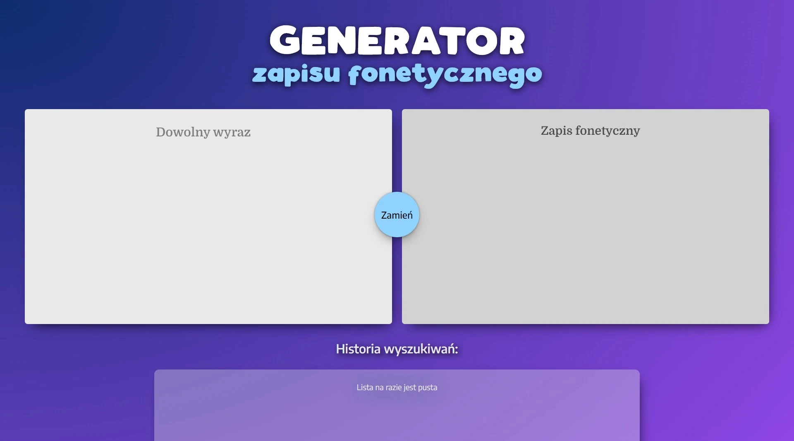

# Fonetyka

  
  
  
  
  
  
  
  
  
  
  

## 📖 Project Description

A comprehensive frontend PWA application for converting Polish words into phonetic transcription using two internationally recognized standards: AS (Slavic Alphabet) and IPA (International Phonetic Alphabet).

### ⚡ Technologies

- **Framework**: [Next.js](https://nextjs.org/docs) with App Router (`/app`)
- **Package Manager**: [pnpm](https://pnpm.io/)
- **PWA**: Offline-first approach with service worker
- **Styling**: Sass/SCSS with CSS modules
- **TypeScript**: Full application typing

### 🚀 Features

- 🔤 Polish phonetic transcription generator
- 🌍 Support for IPA (International Phonetic Alphabet) standard
- 🇵🇱 Support for AS (Slavic Alphabet) standard
- 📱 Responsive design for all devices
- 🔄 Offline functionality (PWA)
- 📜 Search history with quick recall
- ⚡ Real-time transcription conversion
- 🎯 Automatic handling of Polish phonetic rules (voicing, softening, etc.)

###

## ☕ Project Support

If this project has been helpful to you, you can buy me a coffee as a thank you for the work invested.

Thank you for all your support! 🙏
